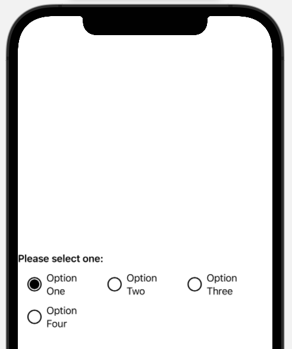
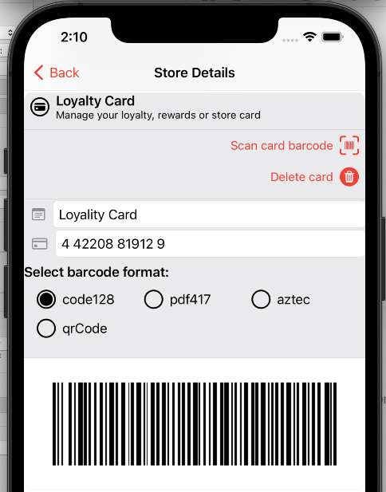

# SwiftletRadioButtonPicker for Swift and SwiftUI

      

Creates a cross-platform Radio Button Picker that allow the user to select from a small group of options by presenting a list of `SwiftletRadioButton` objects that the user can tap on to select one items from the list.

## Support

If you find `SwiftletRadioButton` useful and would like to help support its continued development and maintenance, please consider making a small donation, especially if you are using it in a commercial product:

<a href="https://www.buymeacoffee.com/KevinAtAppra" target="_blank"></a>

It's through the support of contributors like yourself, I can continue to build, release and maintain high-quality, well documented Swift Packages like `SwiftletRadioButton` for free.

<a name="Installation"></a>
## Installation

**Swift Package Manager** (Xcode 11 and above)

1. In Xcode, select the **File** > **Add Package Dependency…** menu item.
2. Paste `https://github.com/Appracatappra/SwiftletRadioButtonPicker.git` in the dialog box.
3. Follow the Xcode's instruction to complete the installation.

> Why not CocoaPods, or Carthage, or blank?

Supporting multiple dependency managers makes maintaining a library exponentially more complicated and time consuming.

Since, the **Swift Package Manager** is integrated with Xcode 11 (and greater), it's the easiest choice to support going further.

## Using SwiftletRadioButtonPicker

The `SwiftletRadioButtonPicker` works best when presenting a very limited number of options to the user. For example: selecting **Male** or **Female**. 

Generally this Picker should only be used for six or less options on platforms like iOS. When the user need to select from a greater number of options, you'll be better suited using one of the standard, built-in SwiftUI Picker views.

### Example

The following code will create a Picker with four options in iOS:

```swift
SwiftletRadioButtonPicker(alignment: .grid, columns: 3, selection:"2")
    .radioButton(id: "0", name: "Option One")
    .radioButton(id: "1", name: "Option Two")
    .radioButton(id: "2", name: "Option Three")
    .radioButton(id: "3", name: "Option Four")
```

Which would display a view like the following:



## Generating from an Enum

Optionally, you can feed any **Enum** that has a raw value and conforms to `CaseIterable, Identifiable` to the `radioButtons` function and the Picker will automatically generate a list of Radio Buttons from the **Enum**.

### Example

Given the following **Enum**:

```swift
/// Defines the format of the barcode to be generated.
public enum BarcodeFormat:String, Codable, Equatable, CaseIterable, Identifiable {
    
    /// Sepcifies a type 128 barcode.
    case code128 = "CICode128BarcodeGenerator"
    
    /// Sepcifies a type PDF 417 barcode.
    case pdf417 = "CIPDF417BarcodeGenerator"
    
    /// Sepcifies an Aztec type barcode.
    case aztec = "CIAztecCodeGenerator"
    
    /// Sepcifies a QR Code type barcode.
    case qrCode = "CIQRCodeGenerator"
    
    public var id:String {
        return rawValue
    }
    
    
    /// Sets the enum from the given `String` value.
    /// - Parameter name: The `String` name that matches a case from the enum.
    /// - Remark: Will default to `code128` if the name cannot be found.
    public mutating func fromName(_ name:String) {
        switch(name.lowercased()) {
        case "code128":
            self = .code128
        case "pdf417":
            self = .pdf417
        case "aztec":
            self = .aztec
        case "qrcode":
            self = .qrCode
        default:
            self = .code128
        }
    }
}
```

And the following code to call the Picker:

```swift
SwiftletRadioButtonPicker(alignment: .grid, title:"Select barcode format:", columns: 3, selection:"code128") { button in
    card.format.fromName(button.id)
    store.refreshUI()
}
.radioButtons(from: BarcodeFormat.self)

```

Would create a Picker that looks similar to the following on iOS:



# Documentation

The **Package** includes full **DocC Documentation** for all features.
